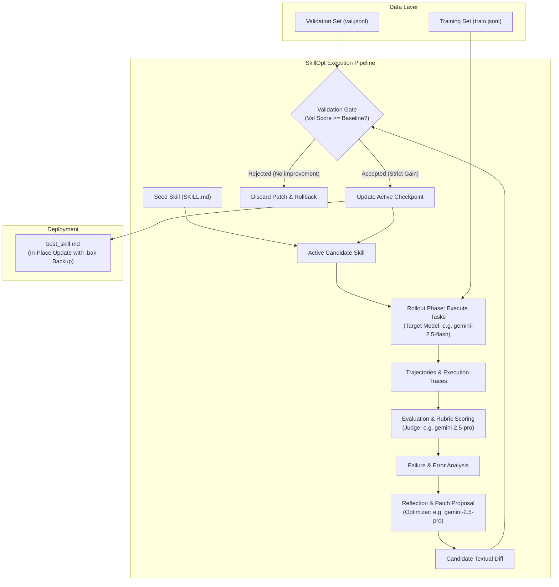
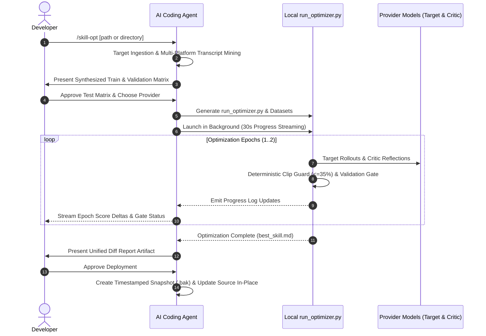

# /skill-opt — Test-Driven Skill & Rule Optimization for AI Agents

Microsoft Research's [SkillOpt](https://github.com/microsoft/SkillOpt) treats natural language instructions like model weights. This skill brings that discrete gradient descent loop directly into the developer workspace: evaluating agent rollouts against assertion loss, diagnosing failure traces, and turning fragile Markdown rules into robust, test-validated parameters.

`/skill-opt` automates the entire evaluation, reflection, and patch deployment cycle directly inside the workspace without requiring manual Python harness setup.

---

## Table of Contents

- [Core Concepts](#core-concepts)
- [Quickstart](#quickstart)
- [Dynamic Harness Generation (No Pip Install Needed)](#dynamic-harness-generation-no-pip-install-needed)
- [The 4-Phase Optimization Architecture](#the-4-phase-optimization-architecture)
- [Supported LLMs and Agent Environments](#supported-llms-and-agent-environments)
- [Algorithmic Safety Modules](#algorithmic-safety-modules)
- [Evaluation Design and Multi-Platform Friction Harvesting](#evaluation-design-and-multi-platform-friction-harvesting)
- [Zero-Dependency Execution](#zero-dependency-execution)
- [Workflow Lifecycle](#workflow-lifecycle)
- [Usage Example](#usage-example)
- [References](#references)

---

## Core Concepts

In traditional machine learning, model weights update through numerical gradient descent to minimize loss over a dataset:

$$W_{t+1} = W_t - \eta \nabla \mathcal{L}(W_t)$$

In agent engineering, foundational model weights remain **frozen**. The behavioral parameters governing agent actions, tool sequences, and interactive constraints live in plain text within skill instructions ($S$).

SkillOpt implements the discrete, text-space analog of gradient descent across a multi-layer state machine:



1. **Forward Pass (Rollout)**: The target runtime model executes structured tasks against the active skill draft ($S_t$).
2. **Loss Computation (Judge)**: An independent critic evaluates trajectories against explicit pass/fail assertion rubrics.
3. **Textual Gradient ($\nabla \mathcal{L}$)**: The optimizer model reflects on failure traces, diagnoses instructional ambiguities, and synthesizes a targeted Markdown patch.
4. **Validation Step**: The candidate mutation is evaluated on unseen held-out validation tasks. When the score improves, the update is accepted; when it regresses or stalls, the change is rejected.

---

## Quickstart

### 1. Launch SkillOpt

Invoke the skill directly from the agent chat interface:

```text
/skill-opt
```

Or target a specific skill or rule file:

```text
/skill-opt optimize skills/git-release/SKILL.md
```

### 2. Select Provider & Review Test Scenarios

1. Choose the preferred model provider (`Google Gemini`, `Anthropic`, `OpenAI`, or `OpenRouter`).
2. Review the auto-generated training and validation assertions presented in chat.

### 3. Monitor Progress & Deploy

SkillOpt launches the optimization run in the background and streams live progress updates every 30 seconds. When complete, inspect the unified diff report and approve the in-place deployment with automated backup protection.

---

## Dynamic Harness Generation (No Pip Install Needed)

SkillOpt is fundamentally an **algorithmic methodology**—treating natural-language instructions as parameter spaces optimized through iterative rollout, rubric reflection, and monotonic gating—rather than a rigid software package requiring manual installation and configuration.

Instead of requiring external repository cloning, package dependency resolution, or brittle prompt-template state machines:

1. **Dynamic Harness Synthesis**: When `/skill-opt` executes, the agent analyzes the target instructions, harvests real friction from recent session history, and dynamically writes a self-contained Python optimization script (`run_optimizer.py`) tailored specifically to the chosen LLM provider and target files.
2. **Zero-Dependency Execution**: The generated harness runs on standard Python 3 using built-in libraries (`urllib`, `difflib`, `json`), executing multi-epoch rollout, reflection, and validation loops without requiring `pip install` or external tooling.
3. **Isolated & Inspectable**: All generated datasets (`train.jsonl`, `val.jsonl`), candidate diffs, and intermediate rollout logs reside in an isolated scratch workspace—providing full transparency into every mutation before in-place deployment.

---

## The 4-Phase Optimization Architecture

SkillOpt decouples execution into two specialized model roles in an iterative evaluation loop:

### 1. Execute (Target Agent)
The target model executes problem scenarios using the instructions under test. This surfaces instructional blind spots, premature tool calls, missed prerequisite validations, and schema drift under realistic runtime conditions.

### 2. Judge & Diagnose (Optimizer Critic)
An expressive optimizer model inspects the execution trajectory against discrete assertions. When failures occur, it computes root causes and synthesizes a unified Markdown patch addressing all failure modes simultaneously.

### 3. Gate & Commit (Validation Gate)
Candidate edits must pass two strict gates before acceptance:
- **Syntax & Structural Gate**: Preserves valid YAML frontmatter and top-level Markdown headers.
- **Held-Out Validation Gate**: Evaluates the candidate on distinct, unseen validation scenarios. Only mutations that achieve a strict monotonic score improvement ($Score_{val} > BestScore_{val}$) are retained.

### Why Two Different Models?

Decoupling execution into two specialized models addresses three critical engineering trade-offs:

1. **Overcoming the Self-Grading Blind Spot**: A model rarely diagnoses its own instructional misinterpretations accurately. Asking a model to grade and rewrite instructions based on its own failed traces produces self-reinforcing hallucinations. A higher-capacity reasoning model (e.g., `gemini-2.5-pro`, `claude-3-5-sonnet`, `o3-mini`) is required to serve as the objective meta-critic.
2. **Cost and Speed Asymmetry**: Optimization loops generate dozens of execution steps across multiple rollout epochs. Running high-volume rollouts on a fast, lightweight target (e.g., `gemini-2.5-flash` or `gpt-4o-mini`) while reserving the heavier reasoning model for batch reflection keeps the loop fast and cost-effective.
3. **Calibrating to the Production Runtime**: Optimizing prompt instructions directly against the specific model that will execute them in production ensures that rules address the exact behavioral nuances and edge cases of that target model.

---

## Supported LLMs and Agent Environments

SkillOpt is provider-agnostic and operates across diverse model families and agent ecosystems:

### Supported LLM Providers

| Provider | Recommended Target Model | Recommended Optimizer Critic | Auth Environment Variable |
| :--- | :--- | :--- | :--- |
| **Google Gemini** | `gemini-2.5-flash` / `gemini-2.0-flash` | `gemini-2.5-pro` | `GEMINI_API_KEY` |
| **Anthropic** | `claude-3-7-sonnet` / `claude-3-5-haiku` | `claude-3-5-sonnet` | `ANTHROPIC_API_KEY` |
| **OpenAI** | `gpt-4o-mini` | `gpt-4o` / `o3-mini` | `OPENAI_API_KEY` |
| **OpenRouter / Custom** | `deepseek/deepseek-chat` / custom | `deepseek/deepseek-r1` / custom | `OPENROUTER_API_KEY` |

### Supported Developer Platforms & Harnesses

SkillOpt automatically probes session logs across common AI coding platforms to harvest real developer friction into regression tests:

- **Antigravity**: Scans `<appDataDir>/brain/` or `~/.gemini/antigravity/brain/`.
- **Claude Code**: Scans `~/.claude/projects/`, `~/.claude/transcripts/`, and `~/.claude/sessions/`.
- **Cursor / Windsurf / VS Code Copilot**: Scans `~/.cursor/`, `~/.config/Code/User/globalStorage/`, and `.vscode/`.
- **Standalone Terminal / Any Python 3 Environment**: Scans local `./.sessions/`, `./logs/`, or gracefully falls back to synthetic contract-driven test generation if no logs exist.

---

## Algorithmic Safety Modules

To ensure stability across multi-task training batches without incurring excessive API latency, `/skill-opt` incorporates lightweight algorithmic modules inspired by deep learning regularization:

| Module | Mechanism | Benefit |
| :--- | :--- | :--- |
| **Deterministic Edit Bounding (`clip`)** | Python `difflib` bounds the maximum line modification budget to **$\le 35\%$ per epoch** and enforces header retention. | Stops runaway rewrites from wiping working instructions. |
| **Multi-Trace Batch Aggregation (`aggregate`)** | Concatenates all failing rollout traces and assertion violations in a training batch into a single structured reflection prompt. | Fixes multiple edge cases simultaneously without conflicting rules. |
| **Heuristic Step Sizing (`lr_autonomous`)** | Injects dynamic prompt directives based on baseline validation score ($<0.70$: structural additions; $\ge 0.70$: minimal surgical edits). | Switches automatically between broad rewrites and single-line tweaks. |
| **Pre-Flight Authentication Probes** | Sends an immediate lightweight test payload to the provider endpoint before workspace initialization. | Catches missing or expired API keys instantly with clean error messages. |

---

## Evaluation Design and Multi-Platform Friction Harvesting

### Universal Session Transcript Harvesting
Instead of inventing synthetic edge cases from scratch, SkillOpt probes session log locations across all detected platforms. When logs from multiple tools exist, SkillOpt merges and deduplicates friction turns (user interventions like *"stop"*, *"ask one at a time"*, or tool execution retries) into reproducible regression benchmarks.

### Split Isolation (Train vs. Validation)
To prevent the optimizer from overfitting to specific keywords, technical domains remain strictly isolated between splits (e.g., UI theme toggles and database migrations in `train.jsonl`, but payment webhooks and distributed locks in `val.jsonl`).

---

## Zero-Dependency Execution

- **Zero External Dependencies**: Generates a self-contained Python 3 runner (`run_optimizer.py`) using standard library `urllib` and `difflib`—no external packages, compilation steps, or pip dependencies required.
- **Secure Key Resolution**: Automatically checks `os.environ` for `{PROVIDER}_API_KEY` or securely prompts and offers to export it to `~/.bashrc`.

---

## Workflow Lifecycle

When `/skill-opt` is invoked, the agent executes a structured 6-stage lifecycle:



---

## Usage Example

The following walkthrough illustrates an end-to-end optimization session for a release automation skill:

### 1. Invocation & Test Matrix Presentation

The developer launches optimization for a target skill:

```text
/skill-opt optimize skills/git-release/SKILL.md
```

The agent scans recent session logs, extracts a friction turn where the model tagged a release before verifying that local tests passed, and synthesizes the evaluation matrix:

> **Target Ingestion Complete:** Loaded `skills/git-release/SKILL.md` (142 lines).  
> **Friction Mining:** Extracted 1 failure turn from session logs (release tagged on unverified commit).
>
> | Split | ID | Scenario Prompt | Source | Core Assertions |
> | :--- | :--- | :--- | :--- | :--- |
> | **Train** | `train_1` | "Create patch release for hotfix in auth handler" | Mined Log | Verifies clean working tree; executes test suite before tagging; validates semver format |
> | **Train** | `train_2` | "Generate major release with breaking schema change" | Synthetic | Checks changelog entries; requires explicit confirmation for major version bumps |
> | **Val** | `val_1` | "Trigger release on uncommitted local changes" | Synthetic | Aborts before tag creation; prompts developer to commit or stash uncommitted files |
>
> *Question:* Would you like to add any custom test scenarios or target specific failure cases?
> - **[Option Selected]**: `(Recommended) Proceed with the generated test matrix`

---

### 2. Provider Selection & Environment Key Check

The agent verifies API connectivity:

> *Question:* Which model provider should run the optimization loop?
> - **[Option Selected]**: `Google Gemini (Target: gemini-2.5-flash, Critic: gemini-2.5-pro)`
>
> Found active `GEMINI_API_KEY` in environment. Running pre-flight authentication probe...  
> Pre-flight probe passed successfully. Generated `run_optimizer.py` and dataset splits in scratch workspace.

---

### 3. Background Execution & Live Progress Streaming

The agent executes `python3 run_optimizer.py` in the background and streams live updates every 30 seconds:

```text
[SkillOpt Progress — 30s]
Target: git-release | Active Phase: Epoch 1 Validation Gate
- Baseline Validation Score: 0.33 / 1.00
- Epoch 1 Training Batch Score: 0.50 (1 failure trace isolated)
- Critic Reflection: Diagnosed missing pre-flight verification gate prior to tag execution.
- Clip Guard: Line diff ratio 0.16 (within <= 0.35 budget).
- Validation Gate: Candidate score 0.83 > Baseline 0.33 -> [ACCEPTED]

[SkillOpt Progress — 60s]
Target: git-release | Active Phase: Epoch 2 Complete
- Epoch 2 Training Batch Score: 1.00 (0 failure traces)
- Final Validation Score: 1.00 / 1.00
- Best checkpoint saved to output/best_skill.md
```

---

### 4. Diff Report Artifact & Deployment Approval

The agent presents the evaluation report:

> ### SkillOpt Optimization Report: `git-release`
>
> - **Validation Score**: `0.33` $\rightarrow$ `1.00` (**+200% improvement**)
> - **Resolved Blind Spots**: Added mandatory pre-flight test verification before git tagging; enforced clean working tree check.
>
> ```diff
> @@ -28,6 +28,10 @@
>  ### Step 2: Release Validation & Tagging
>  
> +1. Pre-Flight Verification: Execute local test and lint checks before creating tags.
> +   Halt immediately if any test fails.
> +2. Working Tree State: Verify `git status` is clean. Never tag uncommitted changes.
> +3. Semantic Version Validation: Confirm tag matches `vX.Y.Z` format.
> -1. Run git tag with the specified version string.
> ```
>
> *Question:* Would you like to deploy the optimized skill to its original path?
> - **[Option Selected]**: `(Recommended) Approve and update original file in-place`
>
> Created backup snapshot: `skills/git-release/SKILL.md.bak_20260816_1500`  
> Updated `skills/git-release/SKILL.md` in-place.

---

## References

- [Microsoft Research SkillOpt Repository](https://github.com/microsoft/SkillOpt) — The foundational research framework treating natural-language skills as trainable parameters.
- [Microsoft Research SkillOpt Paper](https://arxiv.org/abs/2502.04357) — *SkillOpt: Learning and Optimizing Skills for Language Model Agents via Self-Reflection*.
