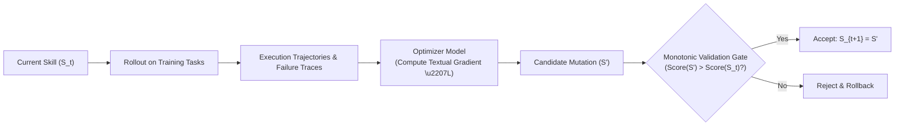
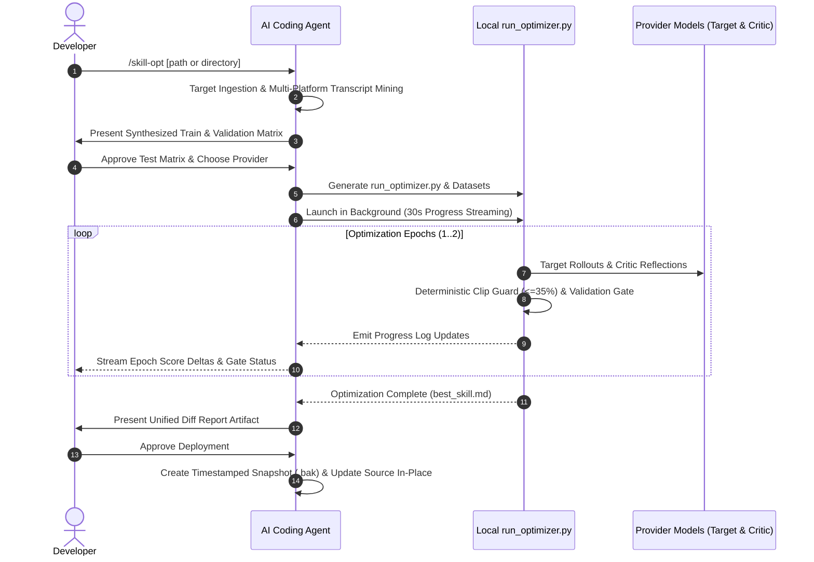

# /skill-opt — Test-Driven Skill & Rule Optimization for AI Agents

> Most agent skills are written once on a hunch, tested twice by hand, and silently break on the third edge case. You only discover the blind spot when the agent ignores an instruction or misfires a tool in production.

`/skill-opt` brings test-driven engineering to prompt and rule development, inspired by Microsoft Research's [SkillOpt](https://github.com/microsoft/SkillOpt) framework. It treats natural-language skill documents (`SKILL.md`) and behavioral rules (`*.md`) as **trainable, versionable parameters** for frozen LLMs—automating trajectory evaluation, root-cause reflection, and validation-gated patch deployment directly in your developer environment.

---

## Core Mental Model: Textual Gradient Descent

In classical machine learning, we update neural network weights via numerical gradient descent to minimize loss over a dataset:

$$W_{t+1} = W_t - \eta \nabla \mathcal{L}(W_t)$$

When engineering autonomous coding agents, the foundational model weights are **frozen**. The behavioral parameters governing agent actions, tool sequences, and interactive constraints are defined in natural language within skill instructions ($S$).

SkillOpt implements the discrete, text-space analog of gradient descent:



1. **Forward Pass (Rollout)**: The target runtime model executes structured tasks against the active skill draft ($S_t$).
2. **Loss Computation (Judge)**: An independent critic evaluates trajectories against explicit pass/fail assertion rubrics.
3. **Textual Gradient ($\nabla \mathcal{L}$)**: The optimizer model reflects on failure traces, diagnoses instructional ambiguities, and synthesizes a targeted Markdown patch.
4. **Validation Step**: The candidate mutation is evaluated on unseen held-out validation tasks. If the score improves, the update is accepted; if it regresses or stalls, the change is rejected.

---

## The 4-Phase Optimization Architecture

SkillOpt decouples execution into two specialized model roles in an iterative evaluation loop:

```
┌────────────────────────────────────────────────────────┐
│ 1. Rollout (Target Model: e.g. gemini-2.5-flash)       │
│    Executes task scenarios against current skill draft │
└──────────────────────────┬─────────────────────────────┘
                           │ Trajectories & tool calls
                           ▼
┌────────────────────────────────────────────────────────┐
│ 2. Judge & Reflect (Optimizer Model: e.g. gemini-2.5)  │
│    Scores rubrics, isolates failure traces, and patches│
└──────────────────────────┬─────────────────────────────┘
                           │ Candidate mutation
                           ▼
┌────────────────────────────────────────────────────────┐
│ 3. Validation Gate                                     │
│    Score improved? Accept. Score dropped? Discard.     │
└────────────────────────────────────────────────────────┘
```

### 1. Rollout (Target Agent)
The target model executes problem scenarios using the instructions under test. This surfaces instructional blind spots, premature tool calls, missed prerequisite validations, and schema drift under realistic runtime conditions.

### 2. Assertion Judge & Multi-Trace Reflection (Optimizer Critic)
An expressive optimizer model inspects the execution trajectory against discrete assertions. When failures occur, it computes root causes and synthesizes a unified Markdown patch addressing all failure modes simultaneously.

### 3. Monotonic Validation Gating
Candidate edits must pass two strict gates before acceptance:
- **Syntax & Structural Gate**: Preserves valid YAML frontmatter and top-level Markdown headers.
- **Held-Out Validation Gate**: Evaluates the candidate on distinct, unseen validation scenarios. Only mutations that achieve a strict monotonic score improvement ($Score_{val} > BestScore_{val}$) are retained.

---

## Supported LLMs & Agent Environments

SkillOpt is provider-agnostic and designed to operate across diverse model families and agent ecosystems:

### Supported LLM Providers

| Provider | Recommended Target Model | Recommended Optimizer Critic | Auth Environment Variable |
| :--- | :--- | :--- | :--- |
| **Google Gemini** | `gemini-2.5-flash` / `gemini-2.0-flash` | `gemini-2.5-pro` | `GEMINI_API_KEY` |
| **Anthropic** | `claude-3-7-sonnet` / `claude-3-5-haiku` | `claude-3-5-sonnet` | `ANTHROPIC_API_KEY` |
| **OpenAI** | `gpt-4o-mini` | `gpt-4o` / `o3-mini` | `OPENAI_API_KEY` |
| **OpenRouter / Custom** | `deepseek/deepseek-chat` / custom | `deepseek/deepseek-r1` / custom | `OPENROUTER_API_KEY` |

### Supported Developer Platforms & Harnesses

SkillOpt automatically probes session logs across common AI coding platforms to harvest real developer friction into regression tests:

- **Antigravity**: Scans `<appDataDir>/brain/` or `~/.gemini/antigravity/brain/`.
- **Claude Code**: Scans `~/.claude/projects/`, `~/.claude/transcripts/`, and `~/.claude/sessions/`.
- **Cursor / Windsurf / VS Code Copilot**: Scans `~/.cursor/`, `~/.config/Code/User/globalStorage/`, and `.vscode/`.
- **Standalone Terminal / Any Python 3 Environment**: Scans local `./.sessions/`, `./logs/`, or gracefully falls back to synthetic contract-driven test generation if no logs exist.

---

## Algorithmic Safety Modules

To ensure stability across multi-task training batches without incurring excessive API latency, `/skill-opt` incorporates lightweight algorithmic modules inspired by deep learning regularization:

| Module | Mechanism | Benefit |
| :--- | :--- | :--- |
| **Deterministic Edit Bounding (`clip`)** | Python `difflib` bounds the maximum line modification budget to **$\le 35\%$ per epoch** and enforces header retention. | Prevents runaway hallucinations and destructive section wipes before validation. |
| **Multi-Trace Batch Aggregation (`aggregate`)** | Concatenates all failing rollout traces and assertion violations in a training batch into a single structured reflection prompt. | Synthesizes a unified patch that resolves multiple failure modes without contradictory rules. |
| **Heuristic Step Sizing (`lr_autonomous`)** | Injects dynamic prompt directives based on baseline validation score ($<0.70$: structural additions; $\ge 0.70$: minimal surgical edits). | Adapts mutation granularity automatically between broad restructuring and fine-tuning. |
| **Pre-Flight Authentication Probes** | Sends an immediate lightweight test payload to the provider endpoint before workspace initialization. | Catches missing or expired API keys instantly with clean error messages. |

---

## Evaluation Design & Multi-Platform Friction Harvesting

### Universal Session Transcript Harvesting
Instead of inventing synthetic edge cases from scratch, SkillOpt probes session log locations across all detected platforms. When logs from multiple tools exist, SkillOpt merges and deduplicates friction turns (user interventions like *"stop"*, *"ask one at a time"*, or tool execution retries) into reproducible regression benchmarks.

### Split Isolation (Train vs. Validation)
To prevent the optimizer from overfitting to specific keywords, technical domains are strictly isolated between splits (e.g., UI theme toggles and database migrations in `train.jsonl`, but payment webhooks and distributed locks in `val.jsonl`).

---

## Zero-Dependency Execution

- **Zero External Dependencies**: Generates a self-contained Python 3 runner (`run_optimizer.py`) using standard library `urllib` and `difflib`—no external packages, compilation steps, or pip dependencies required.
- **Secure Key Resolution**: Automatically checks `os.environ` for `{PROVIDER}_API_KEY` or securely prompts and offers to export it to `~/.bashrc`.

---

## Workflow Lifecycle

When you invoke `/skill-opt`, the agent executes a structured 6-stage lifecycle:



---

## Quickstart

### 1. Launch SkillOpt

Invoke the skill directly from your AI agent chat interface:

```text
/skill-opt
```

Or target a specific skill or rule file:

```text
/skill-opt optimize skills/conductor-implement/SKILL.md
```

### 2. Select Provider & Review Test Scenarios

1. Choose your preferred model provider (`Google Gemini`, `Anthropic`, `OpenAI`, or `OpenRouter`).
2. Review the auto-generated training and validation assertions presented in chat.

### 3. Monitor Progress & Deploy

SkillOpt launches the optimization run in the background and streams live progress updates every 30 seconds. When complete, inspect the unified diff report and approve the in-place deployment with automated backup protection.

---

## References

- [Microsoft Research SkillOpt Repository](https://github.com/microsoft/SkillOpt) — The foundational research framework treating natural-language skills as trainable parameters.
- [Microsoft Research SkillOpt Paper](https://arxiv.org/abs/2502.04357) — *SkillOpt: Learning and Optimizing Skills for Language Model Agents via Self-Reflection*.
