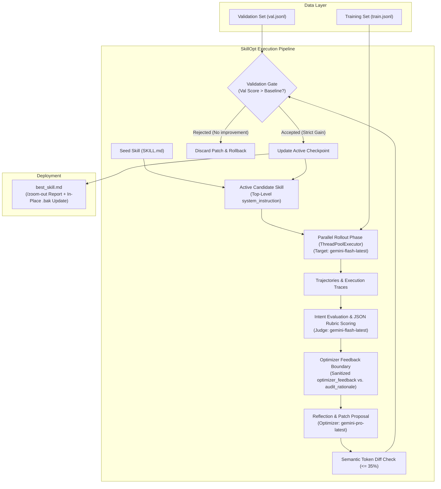
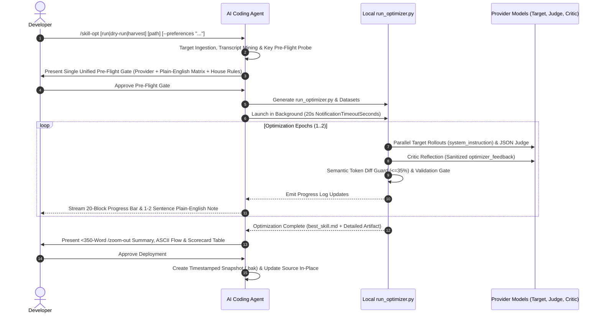

# /skill-opt — Test-Driven Skill & Rule Optimization for AI Agents

[SkillOpt](https://github.com/microsoft/SkillOpt) is an open-source text-space optimizer from Microsoft Research that treats natural-language skill documents as trainable parameters for frozen LLMs, replacing manual prompt tinkering with a reproducible compilation loop. The framework evaluates agents across task batches, using an auxiliary optimizer model to diagnose execution trajectory failures and generate targeted textual patches—additions, deletions, and replacements—for the underlying skill markdown. To maintain optimization stability and prevent regressions, the engine bounds edit sizes through a textual learning-rate budget, maintains a rejected-edit buffer to avoid circular revisions, and commits changes only when they clear a held-out validation gate. The resulting `best_skill.md` artifact deploys directly into agentic harnesses like Claude Code or Codex as a compact, portable instruction set that delivers empirical performance gains with zero runtime overhead or changes to agent logic.

---

## Skill Features

This `/skill-opt` skill automates the entire evaluation, reflection, and patch deployment cycle directly inside the workspace without requiring manual Python harness setup:

- **Zero-Setup Dynamic Harness (`/gemini-api` Aligned)**: Generates a self-contained Python optimizer on the fly using standard library `urllib.request`, `concurrent.futures.ThreadPoolExecutor(max_workers=5)`, top-level `system_instruction` separation, native JSON mode (`responseMimeType: "application/json"`), and auto-updating Gemini model aliases (`gemini-flash-latest`, `gemini-pro-latest`) with hierarchical fallback chains—no `pip install` or external repository clones required.
- **Natural-Language Sub-Modes & House Rules**: Supports full optimization (`run`), non-mutating baseline diagnostics (`dry-run`), transcript friction mining (`harvest`), and inline natural-language optimization constraints (`--preferences`).
- **Multi-Platform Friction Mining**: Mines recent developer corrections and friction turns across Antigravity, Claude Code, Cursor, and local session logs into regression test assertions.
- **Optimizer Feedback Boundary (Anti-Test-Leakage)**: Splits judge evaluations into detailed `audit_rationale` (for human reports) and sanitized `optimizer_feedback` (for the optimizer critic), preventing literal test strings or regexes from leaking into `SKILL.md`.
- **Semantic Token-Level Diff Bounding**: Enforces a whitespace-normalized token modification budget ($\le 35\%$/epoch) and preserves YAML frontmatter, avoiding false-positive rejections from 80-column Markdown line wrapping.
- **Unified Pre-Flight & `/zoom-out` Reporting**: Consolidates setup into a single pre-flight approval gate, streams unbracketed 20-block progress bars in chat, and delivers a `<350`-word plain-language `/zoom-out` executive summary backed by a detailed audit artifact.
- **Safe In-Place Rollback & Snapshots**: Preserves timestamped `.bak` backups in the source directory and supports immediate rollback or constraint refinement.

---

## Table of Contents

- [Skill Features](#skill-features)
- [Core Concepts](#core-concepts)
- [Quickstart](#quickstart)
- [Dynamic Harness Generation (No Pip Install Needed)](#dynamic-harness-generation-no-pip-install-needed)
- [The 4-Phase Optimization Architecture](#the-4-phase-optimization-architecture)
- [Supported LLMs and Agent Environments](#supported-llms-and-agent-environments)
- [Algorithmic Safety Modules](#algorithmic-safety-modules)
- [Evaluation Design and Multi-Platform Friction Harvesting](#evaluation-design-and-multi-platform-friction-harvesting)
- [Zero-Dependency Execution](#zero-dependency-execution)
- [Scheduled Overnight Optimization (Antigravity Sidecar)](#scheduled-overnight-optimization-antigravity-sidecar)
- [Workflow Lifecycle](#workflow-lifecycle)
- [Usage Example](#usage-example)
- [References](#references)

---

## Core Concepts

In traditional machine learning, model weights update through numerical gradient descent to minimize loss over a dataset:

$$W_{t+1} = W_t - \eta \nabla \mathcal{L}(W_t)$$

In agent engineering, foundational model weights remain **frozen**. The behavioral parameters governing agent actions, tool sequences, and interactive constraints live in plain text within skill instructions ($S$).

SkillOpt implements the discrete, text-space analog of gradient descent across a multi-layer state machine:


```mermaid
flowchart TB
    subgraph DataLayer["Data Layer"]
        val["Validation Set (val.jsonl)"]
        train["Training Set (train.jsonl)"]
    end

    subgraph Pipeline["SkillOpt Execution Pipeline"]
        seed["Seed Skill (SKILL.md)"] --> active["Active Candidate Skill\n(Top-Level system_instruction)"]
        active --> rollout["Parallel Rollout Phase (ThreadPoolExecutor)\n(Target: gemini-flash-latest)"]
        train --> rollout
        rollout --> traces["Trajectories & Execution Traces"]
        traces --> judge["Intent Evaluation & JSON Rubric Scoring\n(Judge: gemini-flash-latest)"]
        judge --> boundary["Optimizer Feedback Boundary\n(Sanitized optimizer_feedback vs. audit_rationale)"]
        boundary --> reflect["Reflection & Patch Proposal\n(Optimizer: gemini-pro-latest)"]
        reflect --> diff["Semantic Token Diff Check (<= 35%)"]
        diff --> gate{"Validation Gate\n(Val Score > Baseline?)"}
        val --> gate
        gate -- "Rejected (No improvement)" --> rollback["Discard Patch & Rollback"]
        gate -- "Accepted (Strict Gain)" --> checkpoint["Update Active Checkpoint"]
        checkpoint --> active
    end

    subgraph Deployment["Deployment"]
        checkpoint --> best["best_skill.md\n(/zoom-out Report + In-Place .bak Update)"]
    end
```

1. **Forward Pass (Parallel Rollout)**: The target runtime model executes structured tasks with the active skill draft ($S_t$) injected into the top-level `system_instruction` field.
2. **Loss Computation & Feedback Boundary (Judge)**: An independent critic evaluates trajectories using native JSON mode (`responseMimeType: "application/json"`), emitting both a detailed `audit_rationale` for the human report and a sanitized `optimizer_feedback` summary stripped of literal test strings.
3. **Textual Gradient ($\nabla \mathcal{L}$)**: The optimizer model reflects on the sanitized failure feedback, diagnoses instructional ambiguities, and synthesizes a targeted Markdown patch.
4. **Semantic Diff & Validation Step**: The candidate mutation passes a whitespace-normalized token diff guard ($\le 35\%$) and is evaluated on unseen held-out validation tasks. When the validation score improves without training regression, the update is accepted; otherwise, the change is discarded.

---

## Quickstart

### 1. Launch SkillOpt (With Optional Sub-Modes & House Rules)

Invoke the skill directly from the agent chat interface:

```text
/skill-opt
```

Or specify a sub-mode (`run`, `dry-run`, or `harvest`), target path, and inline `--preferences` constraints:

```text
/skill-opt run skills/git-release/SKILL.md --preferences "Keep under 180 lines and preserve all CLI flags"
/skill-opt dry-run skills/git-release/SKILL.md
/skill-opt harvest skills/git-release/SKILL.md
```

### 2. Approve Unified Pre-Flight Gate

Review the single pre-flight summary covering the provider selection, plain-English test matrix, and active house rules, then confirm to start execution.

### 3. Monitor Live Progress & Review `/zoom-out` Summary

SkillOpt launches the optimization run in the background, streaming unbracketed 20-block progress updates in chat. When complete, review the `<350`-word `/zoom-out` executive summary and scorecard table in chat (with full raw diffs and per-epoch traces linked in the companion artifact) and approve in-place deployment.

---

## Dynamic Harness Generation (No Pip Install Needed)

SkillOpt is fundamentally an **algorithmic methodology**—treating natural-language instructions as parameter spaces optimized through iterative rollout, rubric reflection, and monotonic gating—rather than a rigid software package requiring manual installation and configuration.

Instead of requiring external repository cloning, package dependency resolution, or brittle prompt-template state machines:

1. **Dynamic Harness Synthesis**: When `/skill-opt` executes, the agent analyzes the target instructions, harvests real friction from recent session history, and dynamically writes a self-contained Python optimization script (`run_optimizer.py`) tailored specifically to the chosen LLM provider and target files.
2. **Zero-Dependency `/gemini-api` Execution**: The generated harness runs on standard Python 3 using built-in libraries (`urllib.request`, `concurrent.futures`, `difflib`, `json`), executing multi-epoch rollout, reflection, and validation loops without requiring `pip install` or external tooling.
3. **Isolated & Inspectable**: All generated datasets (`train.jsonl`, `val.jsonl`), candidate diffs, and intermediate rollout logs reside in an isolated scratch workspace—providing full transparency into every mutation before in-place deployment.

---

## The 4-Phase Optimization Architecture

SkillOpt decouples execution into specialized model roles in an iterative evaluation loop:

### 1. Execute (Target Agent)
The target model executes problem scenarios with the candidate `SKILL.md` passed via top-level `system_instruction`. This surfaces instructional blind spots, premature tool calls, missed prerequisite validations, and schema drift under realistic runtime conditions.

### 2. Judge & Sanitize (Feedback Boundary)
A fast structured-JSON judge inspects the execution trajectory against discrete assertions and enforces the **Optimizer Feedback Boundary**:
- **`audit_rationale`**: Exact diagnostic details recorded for the human evaluation artifact.
- **`optimizer_feedback`**: Generalized plain-language behavioral guidance passed to the Optimizer Critic, stripped of literal test prompts, regexes, and magic strings so the critic cannot game the rubric.

### 3. Reflect & Propose (Optimizer Critic)
A high-reasoning optimizer model inspects the active skill alongside the sanitized `optimizer_feedback` and any user `--preferences` house rules, synthesizing a unified Markdown patch addressing all failure modes simultaneously.

### 4. Gate & Commit (Validation Gate)
Candidate edits must pass two strict gates before acceptance:
- **Syntax & Semantic Token Diff Gate**: Preserves valid YAML frontmatter, retains $\ge 50\%$ of existing Markdown headers, and bounds whitespace-normalized token edits to $\le 35\%$.
- **Held-Out Validation Gate**: Evaluates the candidate on distinct, unseen validation scenarios. Only mutations that achieve a strict monotonic score improvement ($Score_{val} > BestScore_{val}$ and $Score_{train} \ge BestScore_{train}$) are retained.

### Why Separate Target, Judge, and Optimizer Roles?

Decoupling execution across specialized model tiers addresses three critical engineering trade-offs:

1. **Overcoming the Self-Grading Blind Spot**: A model rarely diagnoses its own instructional misinterpretations accurately. Asking a model to grade and rewrite instructions based on its own failed traces produces self-reinforcing hallucinations. A higher-capacity reasoning model (`gemini-pro-latest`, `claude-3-5-sonnet`, `o3-mini`) serves as the objective meta-critic.
2. **Cost and Speed Asymmetry**: Optimization loops generate dozens of execution steps across multiple rollout epochs. Running concurrent rollouts and JSON judging on fast Flash models (`gemini-flash-latest` / `gemini-flash-lite-latest`) via `ThreadPoolExecutor(max_workers=5)` while reserving `gemini-pro-latest` for once-per-epoch batch reflection keeps the loop fast and cost-effective.
3. **Calibrating to the Production Runtime**: Optimizing prompt instructions directly against the model tier that executes them in production ensures that rules address the exact behavioral nuances of that target model.

---

## Supported LLMs and Agent Environments

SkillOpt is provider-agnostic and operates across diverse model families and agent ecosystems:

### Supported LLM Providers

| Provider | Recommended Target Model | Recommended Judge Model | Recommended Optimizer Critic | Auth Environment Variable |
| :--- | :--- | :--- | :--- | :--- |
| **Google Gemini** | `gemini-flash-latest` (fallback: `gemini-3.8-flash`, `gemini-3.7-flash`) | `gemini-flash-lite-latest` / `gemini-flash-latest` | `gemini-pro-latest` (fallback: `gemini-3.1-pro-preview`) | `GEMINI_API_KEY` |
| **Anthropic** | `claude-3-7-sonnet` / `claude-3-5-haiku` | `claude-3-5-haiku` | `claude-3-5-sonnet` | `ANTHROPIC_API_KEY` |
| **OpenAI** | `gpt-4o-mini` | `gpt-4o-mini` | `gpt-4o` / `o3-mini` | `OPENAI_API_KEY` |
| **OpenRouter / Custom** | `deepseek/deepseek-chat` / custom | `deepseek/deepseek-chat` | `deepseek/deepseek-r1` / custom | `OPENROUTER_API_KEY` |

### Supported Developer Platforms & Harnesses

SkillOpt automatically probes session logs across common AI coding platforms to harvest real developer friction into regression tests:

- **Antigravity**: Scans `<appDataDir>/brain/` or `~/.gemini/antigravity/brain/`.
- **Claude Code**: Scans `~/.claude/projects/`, `~/.claude/transcripts/`, and `~/.claude/sessions/`.
- **Cursor / Windsurf / VS Code Copilot**: Scans `~/.cursor/`, `~/.config/Code/User/globalStorage/`, and `.vscode/`.
- **Standalone Terminal / Any Python 3 Environment**: Scans local `./.sessions/`, `./logs/`, or gracefully falls back to synthetic contract-driven test generation if no logs exist.

---

## Algorithmic Safety Modules

To ensure stability across multi-task training batches without incurring excessive API latency, `/skill-opt` incorporates lightweight algorithmic modules inspired by deep learning regularization:

| Module | Mechanism | Benefit |
| :--- | :--- | :--- |
| **Semantic Token Edit Bounding (`clip`)** | Normalizes whitespace (`re.split(r"\s+", text)`) and bounds token-level `difflib.SequenceMatcher` distance to **$\le 35\%$ per epoch** while enforcing header retention. | Prevents runaway rewrites without falsely rejecting 80-column Markdown re-wrapping. |
| **Optimizer Feedback Boundary** | Splits judge JSON into `audit_rationale` (for reports) and sanitized `optimizer_feedback` (for reflection). | Prevents the optimizer from overfitting or hardcoding literal test regexes into `SKILL.md`. |
| **Multi-Trace Batch Aggregation (`aggregate`)** | Concatenates all failing rollout traces and sanitized feedback in a training batch into a single structured reflection prompt. | Fixes multiple edge cases simultaneously without conflicting rules. |
| **Heuristic Step Sizing (`lr_autonomous`)** | Injects dynamic prompt directives based on baseline validation score ($<0.70$: structural additions; $\ge 0.70$: minimal surgical edits). | Switches automatically between broad rewrites and single-line tweaks. |
| **Parallel Rollout & Pre-Flight Probes** | Validates API keys upfront and executes task rollouts via `ThreadPoolExecutor(max_workers=5)` with exponential backoff. | Catches missing keys immediately and cuts multi-epoch wall-clock runtime by 3–4x. |

---

## Evaluation Design and Multi-Platform Friction Harvesting

### Universal Session Transcript Harvesting
Instead of inventing synthetic edge cases from scratch, SkillOpt probes session log locations across all detected platforms. When logs from multiple tools exist, SkillOpt merges and deduplicates friction turns (user interventions like *"stop"*, *"ask one at a time"*, or tool execution retries) into reproducible regression benchmarks.

### Split Isolation (Train vs. Validation)
To prevent the optimizer from overfitting to specific keywords, technical domains remain strictly isolated between splits (e.g., UI theme toggles and database migrations in `train.jsonl`, but payment webhooks and distributed locks in `val.jsonl`).

---

## Zero-Dependency Execution

- **Zero External Dependencies**: Generates a self-contained Python 3 runner (`run_optimizer.py`) using standard library `urllib.request`, `concurrent.futures`, and `difflib`—no external packages, compilation steps, or pip dependencies required.
- **Secure Key Resolution**: Automatically checks `os.environ` and shell profiles (`~/.bashrc`, `~/.zshrc`, `~/.profile`) for `{PROVIDER}_API_KEY` or securely prompts before execution.

---

## Workflow Lifecycle

When `/skill-opt` is invoked, the agent executes a streamlined lifecycle designed around `/zoom-out` communication clarity:


```mermaid
sequenceDiagram
    autonumber
    actor Dev as Developer
    participant Agent as AI Coding Agent
    participant Harness as Local run_optimizer.py
    participant LLM as Provider Models (Target, Judge, Critic)

    Dev->>Agent: /skill-opt [run|dry-run|harvest] [path] [--preferences "..."]
    Agent->>Agent: Target Ingestion, Transcript Mining & Key Pre-Flight Probe
    Agent->>Dev: Present Single Unified Pre-Flight Gate (Provider + Plain-English Matrix + House Rules)
    Dev->>Agent: Approve Pre-Flight Gate
    Agent->>Harness: Generate run_optimizer.py & Datasets
    Agent->>Harness: Launch in Background (20s NotificationTimeoutSeconds)
    loop Optimization Epochs (1..2)
        Harness->>LLM: Parallel Target Rollouts (system_instruction) & JSON Judge
        Harness->>LLM: Critic Reflection (Sanitized optimizer_feedback)
        Harness->>Harness: Semantic Token Diff Guard (<=35%) & Validation Gate
        Harness-->>Agent: Emit Progress Log Updates
        Agent-->>Dev: Stream 20-Block Progress Bar & 1-2 Sentence Plain-English Note
    end
    Harness-->>Agent: Optimization Complete (best_skill.md + Detailed Artifact)
    Agent->>Dev: Present <350-Word /zoom-out Summary, ASCII Flow & Scorecard Table
    Dev->>Agent: Approve Deployment
    Agent->>Agent: Create Timestamped Snapshot (.bak) & Update Source In-Place
```

---

## Usage Example

The following walkthrough illustrates an end-to-end optimization session for a release automation skill:

### 1. Invocation & Single Unified Pre-Flight Gate

The developer launches optimization for a target skill with an inline house rule:

```text
/skill-opt run skills/git-release/SKILL.md --preferences "Keep under 160 lines"
```

The agent scans recent session logs, extracts a friction turn where the model tagged a release before verifying that local tests passed, verifies `GEMINI_API_KEY`, and presents a single pre-flight confirmation gate:

> **Target Skill**: `skills/git-release/SKILL.md` (142 lines)  
> **Provider & Models**: Google Gemini (`gemini-flash-latest` target/judge, `gemini-pro-latest` optimizer; API key verified)  
> **House Preferences**: Keep under 160 lines
>
> | Split | Scenario | What We're Testing (Plain English) | Source |
> | :--- | :--- | :--- | :--- |
> | **Train 1** | Hotfix patch release | Runs test suite and checks for a clean working tree before tagging | Mined Friction |
> | **Train 2** | Major breaking schema release | Verifies changelog entry and asks confirmation before major version bump | Skill Contract |
> | **Val 1** | Dirty working tree release | Stops before creating a tag when uncommitted local edits exist | Held-Out Edge Case |
>
> *Question:* How should SkillOpt proceed with this optimization setup?
> - **[Option Selected]**: `(Recommended) Run 2-epoch optimization with this setup`

---

### 2. Background Execution & 20-Block Progress Updates

The agent executes `python3 run_optimizer.py` in the background and streams concise 20-block progress updates in chat:

```text
`▓▓▓▓▓▓▓▓▓▓▓▓░░░░░░░░ 60%` (Task 3 of 5)

Baseline passed 2 of 6 checks (missing pre-tag test verification and dirty-tree guards). Testing Epoch 1 candidate edits from `gemini-pro-latest` against the held-out scenarios next.
```

---

### 3. `/zoom-out` Final Summary & Deployment Approval

When the background run finishes, the agent writes the full line-by-line diff and per-task transcripts to `skillopt_report.md` and presents a `<350`-word `/zoom-out` summary in chat:

> **Bottom Line**: `git-release` improved from **33% to 100%** (6/6 checks passed, up from 2/6) by adding an explicit pre-flight test and clean-tree checklist before `git tag` runs.
>
> ```text
> [Mined Logs] --> [Baseline: 2/6] --> [Added Pre-Tag Gate] --> [Final: 6/6]
> ```
>
> - **The Problem (What Kept Breaking)**: When asked to cut a release quickly, the agent skipped running local tests and tagged directly over uncommitted working-tree changes.
> - **The Fix (What Changed in Plain English)**: Added a 3-step pre-release checklist in Step 2 requiring a clean `git status`, a passing test suite, and semantic version (`vX.Y.Z`) validation before creating any git tag.
> - **The Result & Trade-Off (Did It Work?)**: All 3 training checks and all 3 held-out validation checks now pass, adding 8 lines (+9% semantic token change, staying at 150 lines total).
>
> | Metric | Before (Baseline) | After (Optimized) | Delta |
> | :--- | :--- | :--- | :--- |
> | **Held-Out Validation Pass Rate** | 0/3 (0%) | 3/3 (100%) | +100% |
> | **Training Pass Rate** | 2/3 (67%) | 3/3 (100%) | +33% |
> | **Skill Length & Edit Size** | 142 lines | 150 lines | +8 lines (9% token diff) |
>
> **What You Can Safely Ignore Right Now**: Per-epoch judge JSON payloads, rejected candidate drafts, and the full unified diff are saved in [`skillopt_report.md`](file:///path/to/skillopt_report.md).
>
> *Question:* How should the optimized skill be applied?
> - **[Option Selected]**: `(Recommended) Apply optimized skill in-place (saves .bak backup)`
>
> Created backup snapshot: `skills/git-release/SKILL.md.bak_20261008_1500`  
> Updated `skills/git-release/SKILL.md` in-place.

---

## Scheduled Overnight Optimization (Antigravity Sidecar)

In addition to interactive sessions via `/skill-opt`, the repository includes an automated background optimization daemon in `sidecar/`:

- **Cron-Driven Reflection**: Runs silently overnight (`0 2 * * *` / 2:00 AM) using Antigravity's native `schedule` builtin to discover friction without manual prompting.
- **Friction Harvesting & Synthesis**: Mines session transcripts across Antigravity, Claude Code, and Cursor, auto-synthesizing `/zoom-out` problem summaries with concrete failure examples.
- **Optimizer Feedback Boundary & Parallel Rollouts**: Evaluates candidate edits concurrently with top-level `system_instruction` separation and sanitized `optimizer_feedback`.
- **Adaptive Delivery**:
  - In Git repositories: commits to a dedicated `skillopt/<skill>-<date>` branch and opens a draft GitHub Pull Request (`gh pr create --draft`).
  - Outside Git: stages files in `~/.skillopt/staging/<skill>/`.

See [sidecar/README.md](sidecar/README.md) for quickstart instructions and configuration schema.

---

## References

- [Microsoft Research SkillOpt Repository](https://github.com/microsoft/SkillOpt) — The foundational research framework treating natural-language skills as trainable parameters.
- [Microsoft Research SkillOpt PR #267](https://github.com/microsoft/SkillOpt/pull/267) — Natural-language optimization loop and optimizer feedback boundary.
- [Microsoft Research SkillOpt Paper](https://arxiv.org/abs/2502.04357) — *SkillOpt: Learning and Optimizing Skills for Language Model Agents via Self-Reflection*.
